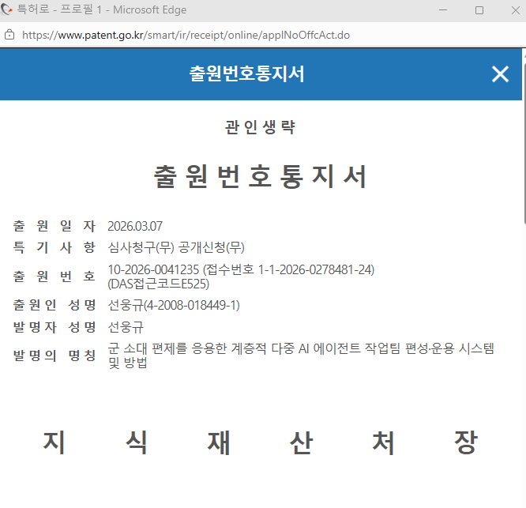

# 특허 정보 (Patent Information)

## 📜 출원번호 통지서



---

## 1. 출원 정보 (Application Details)

| 항목 | 내용 |
|---|---|
| **출원번호 (Application No.)** | `10-2026-0041235` |
| **접수번호 (Receipt No.)** | `1-1-2026-0278481-24` |
| **DAS 접근코드 (DAS Access Code)** | `E525` |
| **출원일 (Filing Date)** | 2026-03-07 |
| **특기사항 (Notes)** | 심사청구(무) · 공개신청(무) |
| **출원인 (Applicant)** | 선웅규 (Sun Woongkyu) · 4-2008-018449-1 |
| **발명자 (Inventor)** | 선웅규 (Sun Woongkyu) |
| **출원기관 (Office)** | 대한민국 특허청 (KIPO · Korean Intellectual Property Office) |

## 2. 발명의 명칭 (Title of Invention)

### 국문명
> **군 소대 편제를 응용한 계층적 다중 AI 에이전트 작업팀 편성·운용 시스템 및 방법**

### 영문명
> **System and Method for Hierarchical Multi-AI Agent Task Team Formation and Operation Applying Military Platoon Organization**

## 3. 국제특허분류 (IPC Classification)

| 분류 | 분야 |
|---|---|
| **G06F 9/46** | 다중 프로그래밍 배열 (Multiprogramming arrangements) |
| **G06F 9/48** | 프로그램 실행 제어 (Program execution control) |
| **G06N 20/00** | 기계학습 (Machine learning) |
| **G06Q 10/06** | 자원·워크플로우·프로젝트 관리 (Resources, workflows, project management) |

## 4. 기술 분야 (Technical Field)

본 발명은 **군사 조직의 소대 편제(Platoon Formation) 형태를 다중 인공지능(AI) 에이전트의 계층적 조율(Orchestration)에 응용한 작업팀 편성 및 운용 시스템과 방법**에 관한 것이다.

구체적으로, 본 발명은:
- 소대 본부 (HQ)
- 복수의 분대 (Squad)
- 외부 AI 풀 (Mercenary Pool)
- 복수 소대의 통합 관제 모듈

로 구성되는 **계층적 지휘 통제(Command & Control) 구조**를 통해, 내부 AI 에이전트와 외부 이종(異種) AI 서비스를 통합적으로 편성·운용하는 시스템 및 방법이다.

## 5. 해결하고자 하는 과제 (Problems to Be Solved)

기존 다중 AI 에이전트 프레임워크의 한계:

1. **편성 원리의 부재** — 에이전트의 수, 팀 구조, 역할 배분에 대한 체계적 원리 없음
2. **이종 AI 통합 미흡** — 단일 AI 플랫폼 내에서만 동작
3. **비선형 확장 문제** — 에이전트 수 증가 시 조율 복잡도가 O(n²)로 폭증
4. **비용 최적화 부재** — 모든 에이전트에 동일 수준의 AI 모델 사용
5. **복수 작업팀 통합 관제 부재**

본 발명은 **군 소대 편제의 검증된 조직 원리**(지휘 통제 범위 3~5개, 3개 분대 편성의 보편성)를 AI 에이전트 오케스트레이션에 적용하여 위 한계를 극복한다.

## 6. 핵심 기술 효과 (Key Technical Effects)

### 통신 복잡도 저감 (O(n²) → O(n))

| 규모 | 평면 구조 | 소대 편제 | 감소율 |
|---:|---:|---:|---:|
| 42명 (1소대) | 861 | 45 | **94.8% ↓** |
| 420명 (10소대) | 87,990 | 423 | **99.5% ↓** |
| 4,200명 (100소대) | 8,817,900 | 4,203 | **99.95% ↓** |

### 차등 모델 사용에 의한 비용 절감

소대장(Opus) → 분대장(Sonnet) → 분대원(Haiku/Sonnet) 차등 배정으로 토큰·API 비용 추가 절감.

## 7. 군사 용어 - 기술 용어 대응 (Term Mapping)

| 군사 용어 | 기술적 명칭 | 구성 요소 종류 |
|---|---|---|
| 지휘관 (Commander) | 시스템 사용자 | **유일한 인간** |
| 소대장 (Platoon Leader) | 오케스트레이터 AI 에이전트 | AI |
| 연락병 (Liaison) | 인터페이스 모듈 | 소프트웨어 모듈 |
| 분대장 (Squad Leader) | 매니저 AI 에이전트 | AI |
| 분대원 (Soldier) | 워커 AI 에이전트 | AI |
| 용병 (Mercenary) | 외부 AI 에이전트 | 외부 AI |
| 무기 (Weapon) | 기능 모듈 | 소프트웨어 모듈 |

**중요**: 본 발명에서 소대를 구성하는 모든 구성원(소대장·분대장·분대원·용병)은 **전부 AI 에이전트**이며, 이들을 지휘하는 것은 **유일한 인간인 "지휘관(Commander)"** 이다. 휴먼 인 더 루프(Human-in-the-Loop) 설계 원칙을 구현하면서, 지휘관 개입은 임무 부여·작전 개시·해산의 **3회 이내로 제한**된다.

## 8. 법적 지위 (Legal Status)

- **상태**: 출원 완료 (Patent Pending)
- **공개 여부**: 출원 시 공개신청(무) — 출원공개 전 단계
- **심사청구**: 미청구 (출원 시점 기준)
- **권리 행사**: 등록 후 가능

> 본 특허는 **출원 단계**입니다. 등록(grant) 전까지는 발명에 대한 특허권이 확정되지 않으며, 출원공개 후 등록까지의 기간에 대해서는 등록 후 출원공개일 이후의 실시에 대한 보상금청구권이 발생합니다.

## 9. 라이선스 (Licensing)

본 저작물(`platoon-formation-claudecode`)은 **Apache License 2.0** 하에 배포됩니다.

Apache License 2.0의 **제3조(Grant of Patent License)** 는 다음을 명시합니다:

> *"...each Contributor hereby grants to You a perpetual, worldwide, non-exclusive, no-charge, royalty-free, irrevocable ... patent license to make, have made, use, offer to sell, sell, import, and otherwise transfer the Work..."*

즉, 본 저작물의 사용자는 **이 저작물의 사용에 필연적으로 침해되는 출원인의 특허 청구항에 대해 무상의 영구적 사용권을 부여받습니다**. 이는 출원 중인 특허가 등록될 경우에도 동일하게 적용됩니다.

단, Apache 2.0 제3조 단서에 따라, 사용자가 본 저작물에 대해 특허 소송을 제기하는 경우 해당 사용자에 대한 특허 라이선스는 자동으로 종료됩니다.

## 10. 인용 (Citation)

본 발명을 학술·기술 문헌에서 인용할 경우 다음 형식을 권장합니다:

```bibtex
@misc{sun2026platoon,
  author       = {Sun, Woongkyu},
  title        = {System and Method for Hierarchical Multi-AI Agent Task Team
                  Formation and Operation Applying Military Platoon Organization},
  howpublished = {Korean Patent Application No. 10-2026-0041235},
  year         = {2026},
  month        = mar,
  note         = {Filed with Korean Intellectual Property Office (KIPO).}
}
```

## 11. 문의 (Inquiry)

특허 라이선스·실시·제휴 등 관련 문의:

- 출원인·발명자: 선웅규 (Sun Woongkyu)
- 이메일: wksun999@gmail.com
- GitHub: [@SUNWOONGKYU](https://github.com/SUNWOONGKYU)

---

*마지막 갱신: 2026-05-30*
